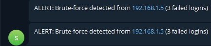
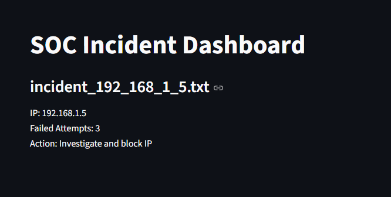

# Incident Response Automation - SOC Tool

A Python-based Security Operations Center (SOC) automation tool that monitors authentication logs, detects brute-force attacks, generates incident reports, and sends real-time alerts via Telegram. The tool also provides a Streamlit dashboard for visualization of incidents.

## Features

- Real-time log monitoring for failed login attempts  
- Brute-force detection based on configurable threshold  
- Automated incident report generation in the `incident_reports/` folder  
- Real-time alerts sent via Telegram  
- Streamlit dashboard displaying detected incidents  
- Easy to extend for additional alert channels or analytics  

## Project Structure

incident-response-automation/
│
├── logs/
│ └── security_logs.txt # Sample logs to monitor
│
├── incident_reports/ # Automatically generated incident reports
│
├── scripts/
│ └── monitor.py # Main monitoring and alerting script
│
├── dashboard.py # Streamlit dashboard
└── README.md

---

## Screenshots

### Telegram Alert
  

### Streamlit Dashboard
  

---

How It Works
The tool reads logs from logs/security_logs.txt.
It counts failed login attempts per IP.
If the number of failed attempts exceeds the threshold, an incident report is generated in incident_reports/.
A Telegram alert is sent to notify about the incident.
The Streamlit dashboard visualizes all recorded incidents.
Customization
Adjust the THRESHOLD variable in monitor.py to change detection sensitivity.
Extend the tool to include additional alert channels such as email or Slack.
Enhance the dashboard with charts, graphs, or attacker geolocation.
Resume / Portfolio Description

Developed a Python-based SOC automation tool that monitors authentication logs, detects brute-force attacks, generates incident reports, and sends real-time alerts via Telegram, with a Streamlit dashboard for visualization.